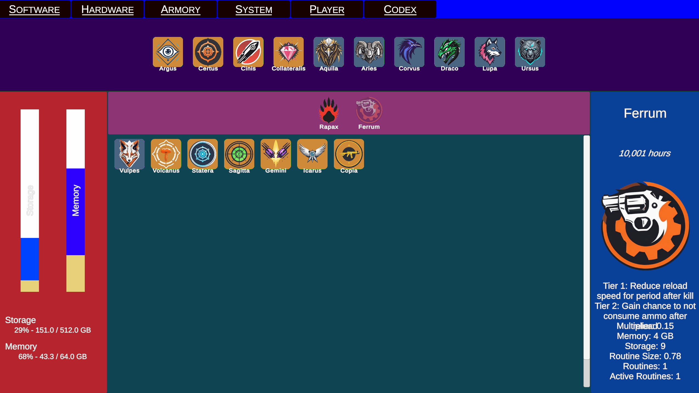
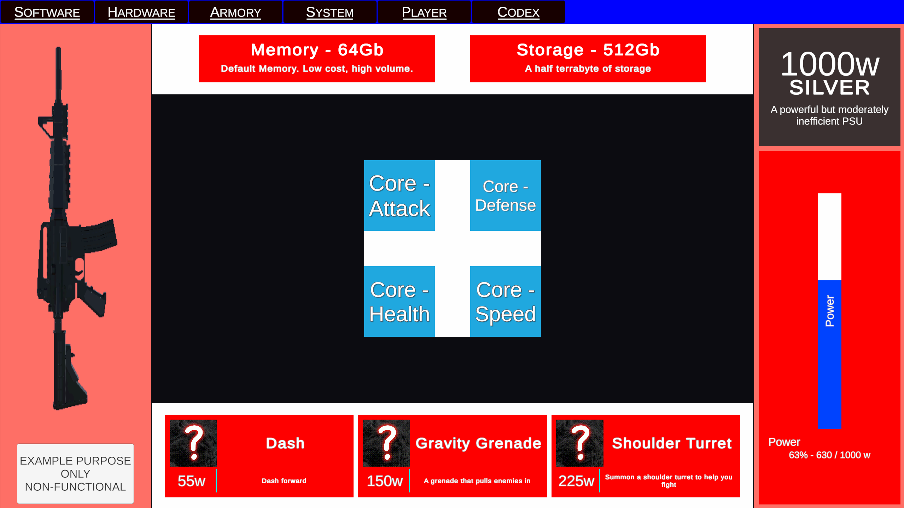
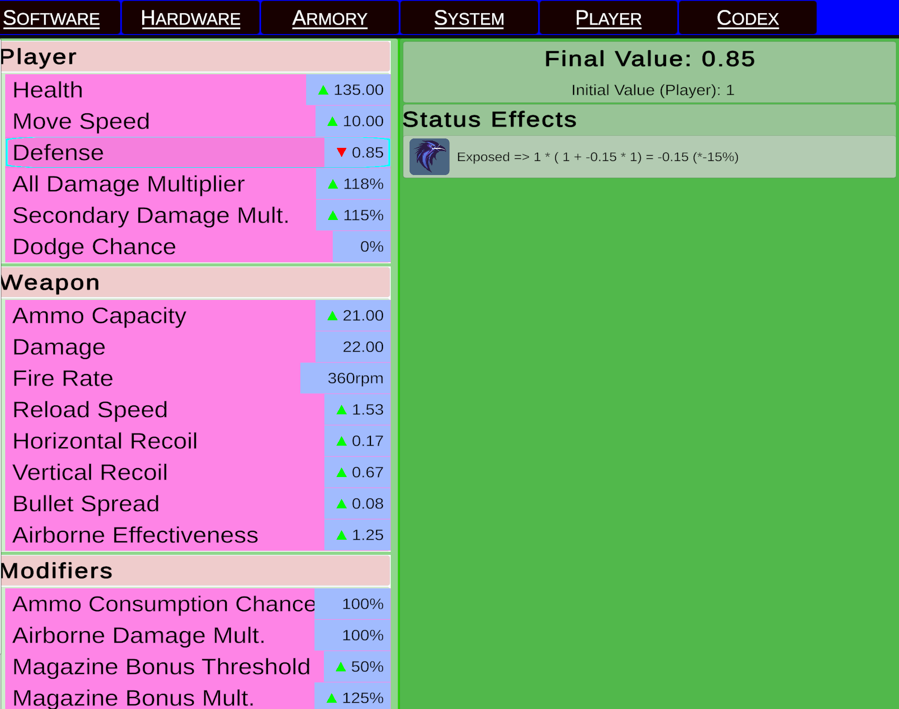

# Iuno
**Unity 6 / C# First Person Shooter Roguelike Prototype - Active Solo Development**

Project Iuno is a prototype game focused around tight gunplay, immersive movement, and resource-driven buildcrafting of powerups all inspired by computer architecture. This project is solo-developed with a focus on systems and function over final art/UI polish.

Features
- 3D movement featuring inertia, momentum, and variable jump height
- Guns with recoil and spread, all whilst being reactive to movement.
- Resource-constrained buildcrafting from changing player stats to abilities, gun behaviors, and inventory management.
- Enemies with varying attack patterns and abilities that react to the player
- Loot tables, ammo economy featuring multiple ammo types and reserve sizes
- In-depth and informative UI for buildcrafting ease and management

Technical Highlights
- Modular IWeapon, IProgram, and IAbility interfaces
- Custom character controller movement
- Fully responsive gun animations relative to player movement and incoming damage strength
- Data-driven architecture using ScriptableObjects for easy gameplay value tweaks/adjustments.
- Compartmentalized Enemy AI built using Unity's Behavior Tree Package
- Interactive and informative User Interface

## Demonstration Video
Showcases gameplay, player buildcrafting, programs, interactive UI, and enemy behaviors.

# Contents
This file contains the following sections.
1. [System Overview](#system-overview)
2. [Demo Guide](#demo-guide)
3. [Project Compilation](#project-compilation)
4. [Controls](#controls)
5. [Design](#design)
6. [AI Content](#ai-content)
7. [Assets](#assets)

For a more in depth idea of plans, see [Devnotes](/Devnotes) folder, which is my active project notes folder used for ideas, and documenting my progress across "sessions" of work.

# System Overview
## Player
The player character has 3 distinct weapons: 2 guns and 1 melee weapon. Each gun has its own ammo type and reserves. Due to only 2 guns (and 1 melee weapon) being present currently, swapping weapon loadout is disabled. The sword has infinite ammo, and has a blocking feature to reduce damage taken.

Upon kill, there is a small chance for each of the following to drop independently of the other:
- Program -> A buff or enhancement for the current player that may change weapon behavior (Such as firing multiple rounds per shot), player stats (Increasing health or defense), or introduce on hit effects (Inflict poison or weakness on target hit). Program of the same type stack, called Routines, which increase the effect of the program either linearly or hyperbolically. 
	- Each enemy type has a unique loot table that prioritizes different rarity programs, with stronger programs being rarer. Stronger enemies are more likely to drop higher rarity programs.
	- Each program belongs to an "Application Suite." When enough of these programs in a suite are acquired, the Suite Bonus will activate, and provide additional effects such as enhancing active programs belonging to that suite, or adding additional effects such as increased reload speed on kill.
	- Some programs feature a rarely dropped "Optimized" version, which is an enhanced version of its original state. It takes less resources, has a unique visual effect applied to icon, and improves the program's base effect. Once acquired, all previous and future programs of the same type will be optimized.
- Ammo Boxes -> A container of ammo that will refill a random amount of currently equipped weapon reserves, prioritizing the ammo type with the least amount remaining. It will refill at least 1 round of every ammo type, and weapons with same ammo type will share awarded amount, with priority to lower ammo reserves. 
	- Kills with the melee weapon will drastically increase drop rate and ammo reward amount. 

The player also has full 3D movement, including momentum-influenced sliding, slope sliding, crouching, variable jump based on jump button press, coyote time, and full weapon and recoil response to all these movements.

## Hardware
The player themselves are themed loosely on a robot or AI construct, and have resource management to encourage buildcrafting within limitations. The resources are broadly referred to as Hardware.
- PSU / Power -> The amount of energy the player has. This resource is used to determine what hardware can be equipped. Each piece of hardware takes up a certain wattage, with better hardware costing more. This power limit cannot be exceeded.
	- There are future plans to enhance this system by including PSU efficiency as well, which adds a bonus to stats for running a gold power supply over a bronze or silver. 
- Storage -> Storage dictates the amount of programs the player can store in their inventory. Each program has a base value that is used once. Each routine adds a smaller amount to this value. The total is the storage cost of a program and its individual routines. For example
		Storage Cost = Base Cost + Routine Size \* Routine Count
- Memory -> Memory dictates the amount of programs that can be active at any given time. Each program has a base memory cost. When equipped, this cost is applied. Each routine adds a small value to this cost, depending on strength of scaling. The formula used is as follows:
		Memory Cost = Base Cost + Routine Size \* Routine Count
- Cores -> The player can equip up to four cores. Each core provides a moderate stat boost to base stats, such as a +25% damage increase, +10% health increase, or +10% speed increase. 
- Expansion Cards / Abilities -> The player can equip up to three unique abilities at a time, ranging from a dash to a shoulder turret to various grenades. Each ability has individual cooldown and charges. Charges accumulate over time via a cooldown upon use.

## Enemies
Currently, there are two enemy types: One ranged enemy, and one melee enemy which has a dash.

Enemy AI currently use basic idle, chase, patrol, and attack behavior, as well as ability/equipment use if specified enemy has such abilities. Player detection is based on line of sight and range, as well as engagement forced chase behavior.

Enemy spawning uses a combination of mechanics.
- Spawn point is determined by a "sweet spot" range. If no valid spawn points are within a certain range of the player, fall back points outside the range can be used.
- There is a slowly increasing cap of permitted enemies at one time, tied to difficulty, which is used to control horde size.
- Enemies can either spawn infinitely from a pool of possible enemies, or be spawned in predetermined waves.
- As encounters progress, budget is accumulated at an accelerating rate. For each attempted spawn, there is a chance that a "Leader" or "Elite" enemy will spawn, which are more expensive. Each enemy type is given a fixed cost, with weaker enemies being cheaper. Cost spending can also determine how many of an enemy spawn at a point, and if any are "Modified", which changes enemy behaviors or stats to make them harder and introduce enemy variants.

## User Interface
The user interface is split into two categories: HUD and Menu. 

HUD is the primary UI seen during gameplay, and features a system log, health, ability cooldown and charges, active weapon, firing state, current ammo, max ammo, reserve ammo, reloading notification, and interact popup, as well as buff/debuff display. There is also a bar at the top center of the screen that shows currently active programs grouped by application suites, as well as if the application suite buff is active.

The menu features multiple tabs, based on need. The first page is Software, which shows current programs in memory, storage, application suites equipped and whether or not they are active, and an overview of the focused element. Programs can be moved freely between memory and storage. Hovering over a program will show, in yellow, the current amount of storage and memory that program is currently taking, out of the total space and total used. 

The hardware page is where the user can equip and change all hardware freely, including memory, storage, cores, expansion cards/abilities, and power supply, as well as view power supply utilization. 

The armory screen is currently under development, but actively displays the 3 equipped weapons in the player's loadout, with future intentions for the user to equip and rearrange weapons as desired. Remnants of this system's original version back when there was only one weapon can be found in the hardware tab.

The Codex tab shows all information gained by the player. At present, it is all unlocked for viewing, and is split into application suites and programs. Clicking on an item will display exact information regarding the program/suite for full clarity on effects.

The Player tab shows all current player stats, and whether or not they are being affected negatively or positively. Clicking on a specific stat will show the exact program, suite, buff, or debuff affecting that stat, as well as exact math on how the final number was acquired. **NOTE**: Does not account for cores at present.

The systems page, and Active/Inactive hooks section of the menu are currently not utilized and are space holders for future planned features, such as loadout swapping via macros or event hooks such as OnReload or OnKill.

# Demo Guide
There are 2 "scenes" or levels in this build at present.

## Testing Range
The default scene is a simple testing range where the enemies by the structure are not able to die. One attacks, with a chance to apply to 'Exposed' effect to demonstrate player health and debuffs system. The other three feature various health pools.

A display board features the highest damage dealt in single attack, a rolling counter of damage dealt over several seconds, and a highest overall damage dealt over that rolling window. 

There is a billboard featuring all player stats currently used and their active values, and a second featuring all active programs and their effects.

There are also infinite ammo pickups, as well as infinite pickups of every program currently in the game, with Lupa (The Wolf Icon on blue background) being the optimized variant.

There are two pillars as well. The "Start Encounter" pillar can be used to start a small enemy wave encounter on a limited AI range for demonstrating and testing the AI in small scale. The "Change Scene" pillar can be used to alternate scenes. Doing so will not reset ammo, programs, or debuffs.

## Demonstration Scene
This scene is an admittedly bland proof of concept of a more open-world, level-like encounter, including infinite spawning, enemy death, program drops, ammo drops, and spawn point acquisition over a large area, with heavy hills to demonstrate movement and AI behavior on a non-flat surface. 

Use the "Change Scene" pillar to change scene back to Testing Range. Doing so will not reset ammo, programs, or debuffs.

# Project Compilation
To compile and run this "game", first ensure Unity 6.4 or later is installed. 

1. Clone [this](https://github.com/bkitterman/Iuno---FPS-Rougelike-Game-Prototype.git) repository to a local disk. 
2. Open Unity Hub, click projects, and then click "Add" next to create project, and choose "Add Project from Disk." 
3. Select the cloned repository destination and open the project.
4. Once loaded into the editor, click File > Build and Run
	First time building may take some time, and your device may become unresponsive in the process. 

**Note**: This is a work in progress build and prototype. Core demonstration features are functional, but it is not impossible for bugs or edge cases to remain.  

# Controls
**Movement**
W - Move Forwards
A - Move Left
S - Move back
D - Move Right
Left Control / V - Crouch
Space - Jump (Quick Tap = Lower, Hold = Higher)
Left Shift - Sprint

**Abilities**
E - Ability One
Q - Ability Two
C - Ability 3

**Weapon Controls**
Left Mouse - Fire / Attack
Right Mouse - Aim Down Sights / Block with Sword
Middle Mouse - Switch Firing Mode
R - Reload
1 - Switch Weapon 1
2 - Switch Weapon 2
3 - Switch Melee
Scroll Wheel - Switch Weapon (Bidirectional)

**Menu Controls**
Tab - Open Menu
Left Click (On Program in Software Tab) - Move one routine to alternative container (Memory <-> Storage)
Left Click, Hold and Drag (On Program in Software Tab) - Move Program
Right Click (On Program or Suite in Software Tab) - View Item Information

# Design
I coded this project based on a few concepts.
- Data Driven: All tweakable values are easily exposed as a scriptable object or directly to the editor to allow for fine tuning of values in live time for testing. This can include anything from program values and rarity (including border color), enemy information, player stats, and hardware information.
- Iterative Improvement: Features are prototyped vertically, often in a single file, until the concept has proven itself valuable, entertaining, and functional before several repeated passes to reduce class sizes, overhead, and splitting monolith files into separate responsible classes under a single controller.

Currently undergoing large, under-the-hood renovations to transition from a single weapon, ammo-less system to a three-weapon, ammo-driven system.

# AI Content
No code was written in this project by any AI tools. However, 2D assets, limited to program icons, were generated using SDXL and ComfyUI. They are merely placeholders to have something more interesting to look at than poor scribbles and will be entirely removed before considering this project complete.

# Assets
All models, excluding the "terrain" (if we're generous enough to call it that) in the sample scene were acquired via the Unity Asset store. No models are my own. 

The same can be said for all audio files, which were sourced from online sound effect websites.
